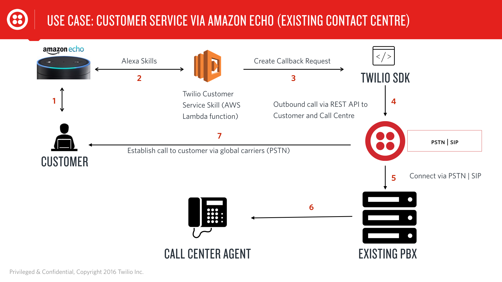
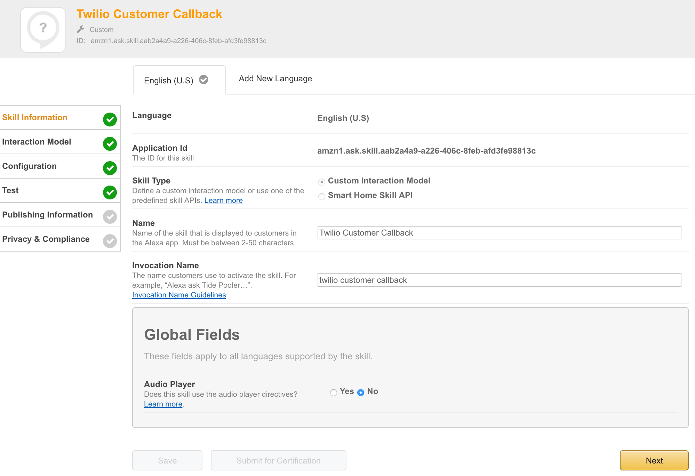
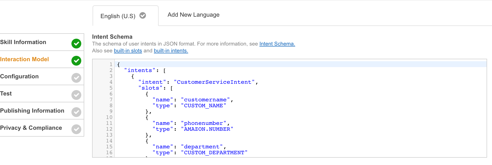
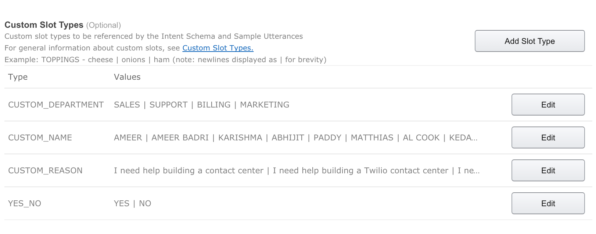
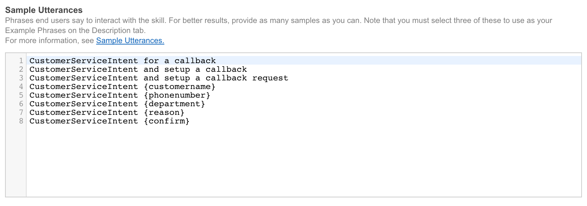
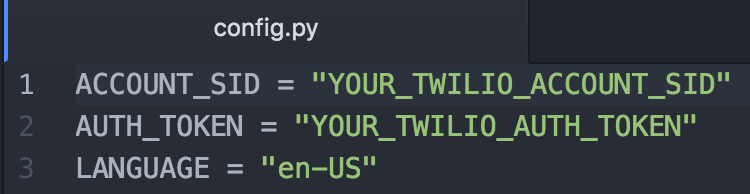
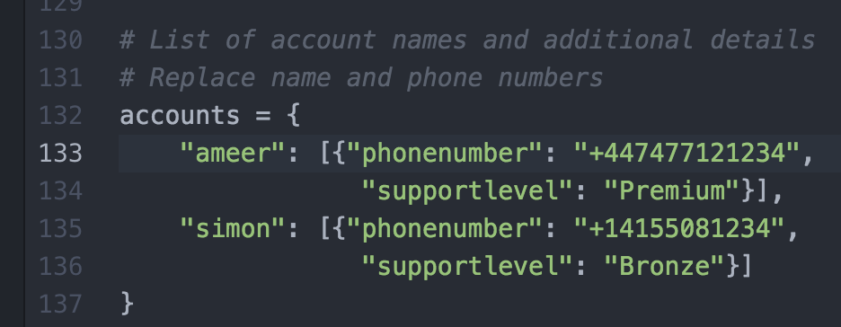
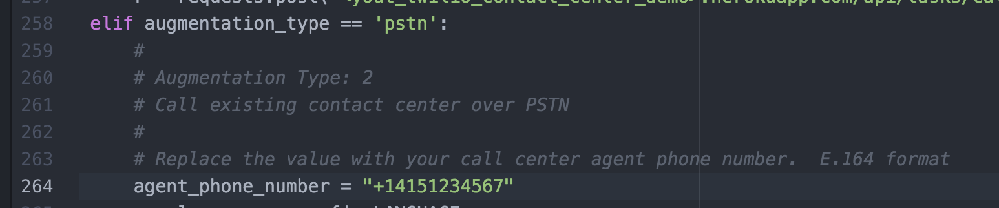

# Amazon Alexa and Twilio Powered Customer Service
Imagine a scenario where you can quickly request a phone callback from a customer service agent without searching for or dialing a company’s toll-free phone support line.

Today, such streamlined customer journeys are easy to create when we consider augmenting the emerging world of voice assistant driven customer interactions with existing contact centre investments.  One such technology is Amazon Alexa, it provides the programming blocks to implement voice based interactions with a customer through the Amazon Echo speaker.  While Twilio provides the voice communication layer between the customer and your backend contact centre infrastructure.

# A possible customer journey using Amazon Echo:
* Customer initiates the callback service skill by saying: “Alexa ask Twilio customer callback”
* Alexa interacts and collects the context and reason for callback request from the customer.
* Then Alexa custom skills (via the AWS lambda function) invokes the Twilio server side Python SDK.
* Twilio Python SDK using the Twilio REST API follows one of the three possible flows to connect to the call centre:
	* For PSTN connectivity to the contact centre, Twilio will dial the contact centre and customer’s phone number and bridge the two party.
	* For SIP connectivity to the contact centre, Twilio will connect to  the contact centre's (PBX/SBC) over SIP 2.0 and customer’s phone number and bridge the two party.
	* For connection to a Twilio based contact centre, your web application  will first create a task for the agent (using TaskRouter).  When the next available agent accepts the task, Twilio will initiate a call from the agent desktop (using WebRTC) to the customer’s phone (via global carrier network) and bridge the two party.

To learn how to build your own Amazon Echo/Alexa custom skills and integrate into your existing contact centre using Twilio's APIs, please follow this post for step by step instructions.

Let's get started... 

# Pre-requisites  
* Amazon Echo (you can buy here: [Amazon UK](https://www.amazon.co.uk/dp/B01GAGVIE4), [Amazon US](https://amzn.com/B00X4WHP5E))
* Knowledge of [Alexa Custom Skills](https://developer.amazon.com/edw/home.html#/skills/list)
* Twilio Account [Sign up here](https://www.twilio.com/try-twilio)
* Knowledge of [Twilio voice API](https://www.twilio.com/voice/api)

Level: Intermediate, Advanced

# High level Architecture:

# Architectural Components Setup:
  a) Alexa Custom Skills Configuration:
  The Alexa custom skills provides speech to text functionality, intent recognition and extraction of attributes from spoken phrases.  These instructions assume you’re familiar with developing Alexa custom skills. 

# Skill Information setup:

# Interaction Model:
  Next, we need to setup and train Alexa with our interaction model.  Your setup will look like this:
Intent Schema:

Custom Slots:

Sample Utterances:

	
Note: The source model can be found on this github repository 

b) AWS Lambda function to interact with Alexa skills: 
The AWS lambda function works in conjunction with Alexa custom skills to provide the business logic needed for the conversation between the user and Alexa.  It also gathers the required attributes and eventually passes it to Twilio REST API to make the outbound call to the contact centre and customer.
You’ll need to configure the following:
config.py: Replace the value for Twilio Account Sid and Auth Token with your own credentials.

Lambda_function.py: Replace the following values.

Once you have made the above changes, you’ll need to zip all the files in the “lambda function” folder.  On OS X, the system will create Archive.zip file.  You’ll upload this ZIP file to AWS as your lambda function.

Note: Makes sure you only zip the contents (files and sub-folders)  of the “lambda function” folder and not the folder itself.
The source code for the Lambda function can be found on this github repository 

Next, you’ll need to enable this custom skill in your Alexa app connected to your Amazon Echo.
Finally, invoke the Alexa customer callback skill by saying the following to your Amazon Echo:
# “Alexa open twilio customer callback”

# Summary
It’s important to serve customers over newly emerging channels for better customer experience and to differentiate your brand.  Integrating Amazon Echo and Alexa Skills as newer channels into your existing contact center infrastructure is pretty easy.  Twilio provides the critical communications glue between these consumer devices and your backend contact centre infrastructure.

I hope you found this post helpful.  I look forward to hearing about your use cases.
